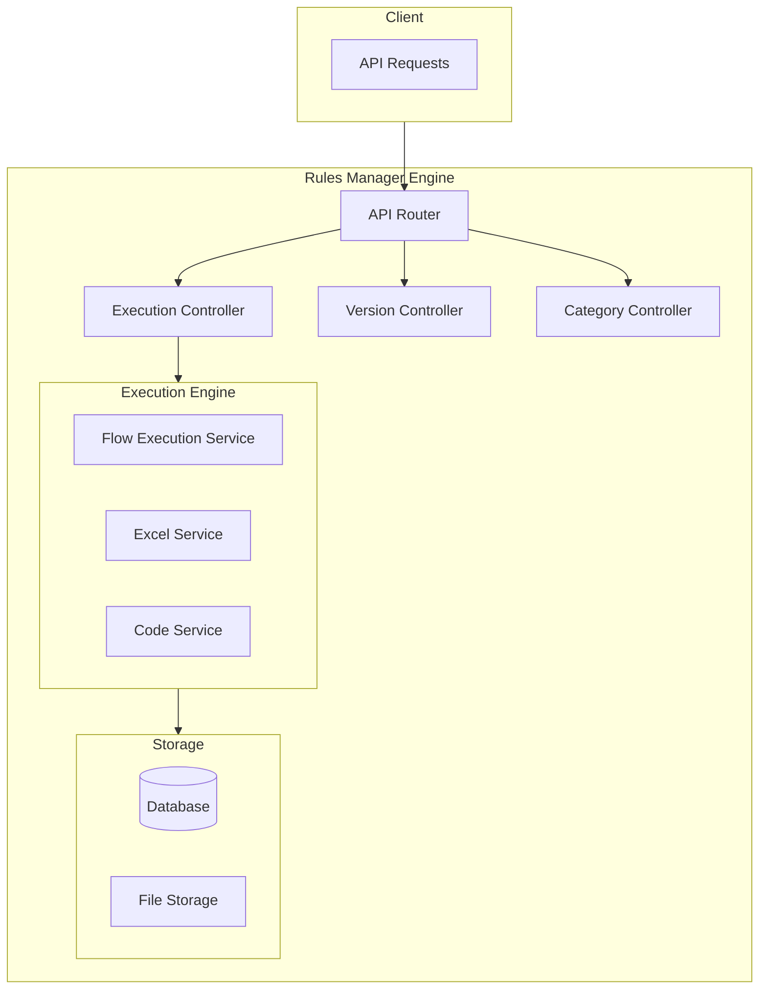
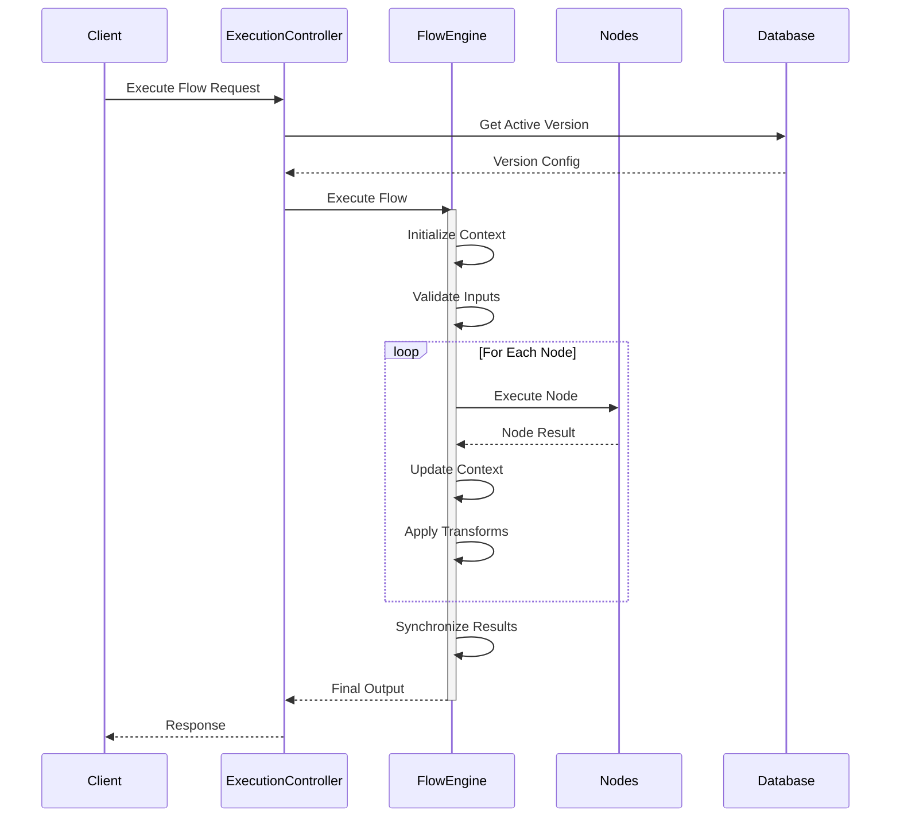

# Rules Manager

A powerful business rules engine that transforms Excel-based business logic into RESTful APIs. Define your business rules using Excel's named ranges and formulas, then expose them as versioned API endpoints for seamless integration into your applications.

## Documentation

### Getting Started
- [Getting Started Guide](./docs/getting-started.md) - Quick introduction and key benefits
- [Installation Guide](./docs/installation-guide.md) - Setup and configuration
- [API Documentation](./docs/api-documentation.md) - Complete API reference

### Advanced Topics
- [Flow Execution Guide](./docs/flow-execution-guide.md) - Understanding flow execution
- [Parallel Flow Execution](./docs/parallel-flow-execution.md) - Advanced parallel processing

## System Architecture



## Key Features

### Rule Definition
- **Excel-Based Rules**
  - Use familiar Excel formulas and functions
  - Define inputs/outputs using named ranges (IP_/OP_ prefixes)
  - Support for complex calculations and conditional logic

- **Code-Based Rules**
  - Write custom JavaScript/TypeScript logic
  - Full programming flexibility
  - Direct access to execution context

- **Flow-Based Rules**
  - Visual flow designer for complex rule chains
  - Parallel execution paths
  - Conditional branching
  - Data transformation between nodes

### Version Management
- Multiple versions per rule category
- Active/inactive version control
- Semantic versioning (MAJOR.MINOR.PATCH)
- Version history tracking

### Flow Execution



## API Endpoints

For detailed API documentation and examples, see [API Documentation](./docs/api-documentation.md).

### Categories
- `POST /api/categories` - Create category
- `GET /api/categories` - List categories
- `GET /api/categories/:id` - Get category
- `PATCH /api/categories/:id` - Update category
- `DELETE /api/categories/:id` - Delete category

### Versions
- `POST /api/categories/:id/versions` - Create version
- `GET /api/categories/:id/versions` - List versions
- `PATCH /api/versions/:id` - Update version
- `DELETE /api/versions/:id` - Delete version

### Execution
- `POST /api/categories/:id/execute` - Execute active version
- `POST /api/versions/:id/execute` - Execute specific version

## Flow Configuration

For detailed flow configuration and examples, see [Flow Execution Guide](./docs/flow-execution-guide.md).

## Tech Stack

- **Backend**: Node.js with Express
- **Database**: PostgreSQL
- **ORM**: TypeORM
- **Architecture**: MVC (Model-View-Controller)

## Project Structure

```
├── src/
│   ├── controllers/     # Request handlers
│   ├── services/        # Business logic
│   ├── models/          # Database entities
│   ├── routes/          # API routes
│   ├── middleware/      # Custom middleware
│   ├── utils/           # Helper functions
│   ├── config/          # Configuration files
│   └── app.ts           # Application entry point
├── test/                # Test files
├── uploads/             # Temporary file storage
└── package.json         # Project dependencies
```

## Support and Community

- [GitHub Issues](https://github.com/your-repo/issues) - Report bugs and request features
- [Discord Community](https://discord.gg/your-server) - Join discussions and get help
- Contact support at support@your-domain.com
