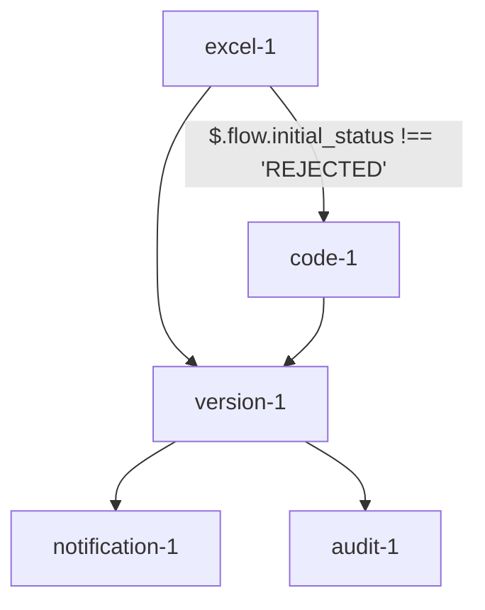

# Parallel Flow Execution

## Overview
Parallel flow execution enables multiple paths of execution from a single node, with optional conditions determining which paths are taken. This document outlines the technical implementation and scenarios for parallel execution in the Rules Manager.

## Key Concepts

### Parallel Connections
- Multiple outgoing connections from a single node
- Independent execution paths
- Optional conditions per connection
- Synchronization at convergence points
- Support for array-based connections

### Execution Order
1. Nodes are executed in topological order using getInputNodes and areInputNodesExecuted
2. Parallel paths are executed concurrently through Promise.all
3. Dependent nodes wait for all incoming connections to complete
4. Results are synchronized using updateContext and synchronizeResults

### Connection Definition
```json
{
  "connections": [
    {
      "from": {
        "node": "excel-1",
        "outputs": {
          "$.flow.initial_status": "$.OP_STATUS",
          "$.flow.credit_rating": "$.OP_CREDIT"  // Outputs directly to flow variables
        }
      },
      "to": {
        "node": "code-1",
        "inputs": {  // Using flow variables as inputs
          "status": "$.flow.initial_status",
          "credit": "$.flow.credit_rating"
        }
      },
      "condition": "$.flow.initial_status !== 'REJECTED'"  // Conditions using flow variables
    },
    {
      "from": [  // Multiple source nodes updating flow variables
        {
          "node": "excel-1",
          "output": "$.flow.risk_score"
        },
        {
          "node": "code-1",
          "output": "$.flow.compliance_score"
        }
      ],
      "to": {
        "node": "version-1",
        "input": "$.flow.combined_score",  // Store result in flow variable
        "transform": "($.flow.risk_score + $.flow.compliance_score) / 2"  // Transform using flow variables
      }
    },
    {
      "from": {
        "node": "version-1",
        "output": "$.flow.approval_status"  // Store in flow variable
      },
      "to": [  // Broadcasting flow variable to multiple nodes
        {
          "node": "notification-1",
          "input": "status",
          "value": "$.flow.approval_status"
        },
        {
          "node": "audit-1",
          "input": "decision",
          "value": "$.flow.approval_status"
        }
      ]
    }
  ]
}
```

## Execution Scenarios

### Scenario 1: All Paths Valid
1. Source node completes execution
2. All conditions evaluate to true
3. All parallel paths execute concurrently
4. Results synchronized at convergence

### Scenario 2: Partial Path Execution
1. Source node completes execution
2. Some conditions evaluate to false
3. Only valid paths execute
4. System tracks completed paths

### Scenario 3: No Valid Paths
1. Source node completes execution
2. All conditions evaluate to false
3. No parallel paths execute
4. Flow continues to next available path

### Scenario 4: Error Handling
1. Source node completes execution
2. Parallel paths begin execution
3. Error occurs in one path
4. Other paths continue execution
5. Error propagated to error handling system

## How Parallel Execution Works with Conditions and Transforms

### Conditions
Conditions are evaluated before executing a connection. If the condition evaluates to true, the connection is followed, and the target node is executed. If the condition evaluates to false, the connection is skipped, and the target node is not executed.

### Transforms
Transforms are applied to the data being passed through a connection. The transform logic is defined in the connection definition and is executed to modify the data before it is passed to the target node. This allows for dynamic data manipulation and ensures that the target node receives the correct input format.

## Sample cURL Command for Parallel Execution with Conditions

```sh
curl -X POST http://localhost:3000/api/execute/your-category-id \
  -H "Content-Type: application/json" \
  -d '{
        "policy_premium": 1000,
        "initial_status": "APPROVED",
        "credit_rating": 750
      }'
```

## Step-by-Step Execution Handling

1. **Initialization**: The flow execution starts by initializing the context with input parameters and flow variables.
2. **Node Execution**: Nodes are executed in topological order. For each node:
   - Input nodes are identified using `getInputNodes`.
   - Conditions for connections are evaluated using `evaluateCondition`.
   - If conditions are met, the node is executed.
   - Results are stored in the context.
3. **Parallel Execution**: Parallel paths are executed concurrently using `Promise.all`.
4. **Synchronization**: Dependent nodes wait for all incoming connections to complete. Results are synchronized using `updateContext` and `synchronizeResults`.
5. **Transforms**: Transform logic is applied to modify data before passing it to the target node using `handleTransform`.
6. **Completion**: The flow execution completes when all nodes have been executed and results are synchronized.

## Complete cURL for Flow Version Creation

```sh
curl -X POST http://localhost:3000/api/categories/your-category-id/versions/flow \
  -H "Content-Type: application/json" \
  -d '{
        "name": "Flow Version 1",
        "description": "Sample flow version",
        "type": "flow",
        "inputColumns": {
          "policy_premium": {
            "type": "number"
          }
        },
        "outputColumns": {
          "result": {
            "type": "number"
          }
        },
        "variables": {
          "initial_status": {
            "type": "string",
            "default": "PENDING"
          },
          "credit_rating": {
            "type": "number",
            "default": 0
          }
        },
        "flow": {
          "nodes": [
            {
              "id": "excel-1",
              "type": "excel",
              "config": {
                "mode": "inline",
                "excel_file": "example.xlsx",
                "input_mapping": {
                  "IP_policy_premium": "$.flow.policy_premium"
                },
                "output_mapping": {
                  "$.flow.result": "$.OP_result"
                },
                "metadata": {
                  "name": "Premium Calculator",
                  "description": "Calculates premium based on input",
                  "tags": [
                    "premium",
                    "calculation"
                  ]
                }
              }
            },
            {
              "id": "code-1",
              "type": "code",
              "config": {
                "mode": "inline",
                "code": "return { status: 'APPROVED', credit: 750 };",
                "input_mapping": {
                  "status": "$.flow.initial_status",
                  "credit": "$.flow.credit_rating"
                },
                "output_mapping": {
                  "$.flow.status": "status",
                  "$.flow.credit": "credit"
                },
                "metadata": {
                  "name": "Credit Check",
                  "description": "Performs credit check",
                  "tags": [
                    "credit",
                    "check"
                  ]
                }
              }
            },
            {
              "id": "version-1",
              "type": "code",
              "config": {
                "mode": "inline",
                "code": "return { combined_score: (risk_score + compliance_score) / 2 };",
                "input_mapping": {
                  "risk_score": "$.flow.risk_score",
                  "compliance_score": "$.flow.compliance_score"
                },
                "output_mapping": {
                  "$.flow.combined_score": "combined_score"
                },
                "metadata": {
                  "name": "Score Aggregator",
                  "description": "Aggregates risk and compliance scores",
                  "tags": [
                    "score",
                    "aggregation"
                  ]
                }
              }
            },
            {
              "id": "notification-1",
              "type": "code",
              "config": {
                "mode": "inline",
                "code": "console.log('Notification sent with status:', status);",
                "input_mapping": {
                  "status": "$.flow.approval_status"
                },
                "output_mapping": {},
                "metadata": {
                  "name": "Notification Sender",
                  "description": "Sends notification",
                  "tags": [
                    "notification",
                    "send"
                  ]
                }
              }
            },
            {
              "id": "audit-1",
              "type": "code",
              "config": {
                "mode": "inline",
                "code": "console.log('Audit logged with decision:', decision);",
                "input_mapping": {
                  "decision": "$.flow.approval_status"
                },
                "output_mapping": {},
                "metadata": {
                  "name": "Audit Logger",
                  "description": "Logs audit decision",
                  "tags": [
                    "audit",
                    "log"
                  ]
                }
              }
            }
          ],
          "connections": [
            {
              "from": {
                "node": "excel-1",
                "outputs": {
                  "$.flow.initial_status": "$.OP_STATUS",
                  "$.flow.credit_rating": "$.OP_CREDIT"
                }
              },
              "to": {
                "node": "code-1",
                "inputs": {
                  "status": "$.flow.initial_status",
                  "credit": "$.flow.credit_rating"
                }
              },
              "condition": "$.flow.initial_status !== 'REJECTED'"
            },
            {
              "from": [
                {
                  "node": "excel-1",
                  "output": "$.flow.risk_score"
                },
                {
                  "node": "code-1",
                  "output": "$.flow.compliance_score"
                }
              ],
              "to": {
                "node": "version-1",
                "input": "$.flow.combined_score",
                "transform": "($.flow.risk_score + $.flow.compliance_score) / 2"
              }
            },
            {
              "from": {
                "node": "version-1",
                "output": "$.flow.approval_status"
              },
              "to": [
                {
                  "node": "notification-1",
                  "input": "status",
                  "value": "$.flow.approval_status"
                },
                {
                  "node": "audit-1",
                  "input": "decision",
                  "value": "$.flow.approval_status"
                }
              ]
            }
          ]
        }
      }'
```

## How Transforms are Executed and Passed Inside the Next Node as Input

Transforms are defined in the connection definition and are executed to modify the data before it is passed to the target node. The transform logic is applied to the data being passed through the connection, ensuring that the target node receives the correct input format.

### Example
In the following connection definition, a transform is applied to combine the risk score and compliance score before passing it to the target node:

```json
{
  "from": [
    {
      "node": "excel-1",
      "output": "$.flow.risk_score"
    },
    {
      "node": "code-1",
      "output": "$.flow.compliance_score"
    }
  ],
  "to": {
    "node": "version-1",
    "input": "$.flow.combined_score",
    "transform": "($.flow.risk_score + $.flow.compliance_score) / 2"
  }
}
```

In this example, the transform logic `($.flow.risk_score + $.flow.compliance_score) / 2` is executed to calculate the combined score, which is then passed to the `version-1` node as the input `$.flow.combined_score`.

## Handling Connections with Both Input and Inputs

When a connection's `to` property has both `input` and `inputs`, the system processes them as follows:

1. **Single Input**: If the `input` property is present, the value is directly assigned to the specified input of the target node.
2. **Multiple Inputs**: If the `inputs` property is present, the values are mapped to the corresponding inputs of the target node.

### Example
In the following connection definition, both `input` and `inputs` are used:

```json
{
  "from": {
    "node": "version-1",
    "output": "$.flow.approval_status"
  },
  "to": [
    {
      "node": "notification-1",
      "input": "status",
      "value": "$.flow.approval_status"
    },
    {
      "node": "audit-1",
      "inputs": {
        "decision": "$.flow.approval_status",
        "timestamp": "$.flow.timestamp"
      }
    }
  ]
}
```

In this example:
- The `notification-1` node receives the `$.flow.approval_status` value as the `status` input.
- The `audit-1` node receives the `$.flow.approval_status` value as the `decision` input and the `$.flow.timestamp` value as the `timestamp` input.

## Mermaid Diagram for Flow Version Nodes


