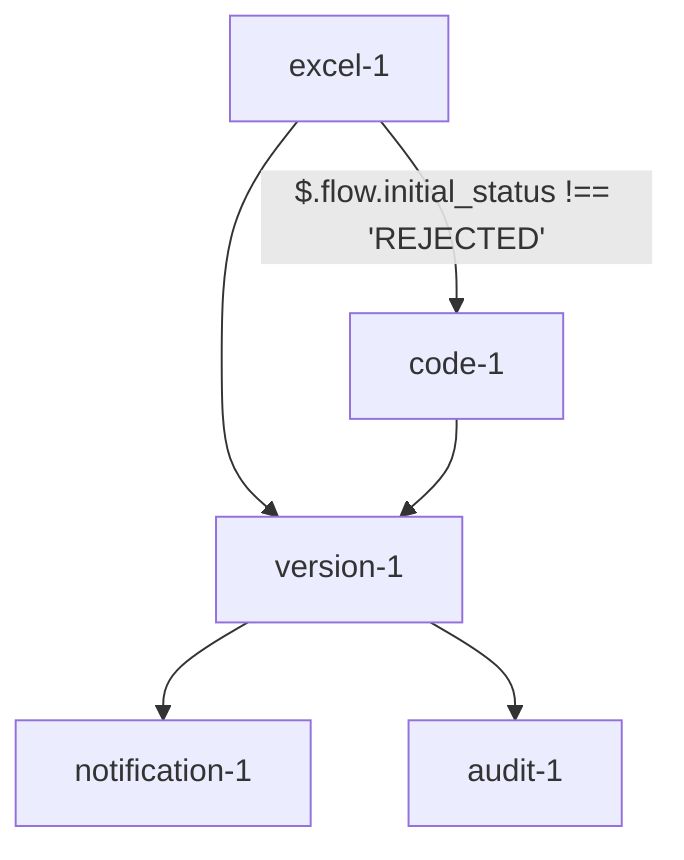

# Parallel Flow Execution

## Overview
Parallel flow execution enables multiple paths of execution from a single node, with optional conditions determining which paths are taken. This document outlines the technical implementation and scenarios for parallel execution in the Rules Manager.

## Key Concepts

### Parallel Connections
- Multiple outgoing connections from a single node
- Independent execution paths
- Optional conditions per connection
- Synchronization at convergence points
- Support for array-based connections

### Execution Order
1. Nodes are executed in topological order using getInputNodes and areInputNodesExecuted
2. Parallel paths are executed concurrently through Promise.all
3. Dependent nodes wait for all incoming connections to complete
4. Results are synchronized using updateContext and synchronizeResults

### Connection Definition
```json
{
  "connections": [
    {
      "from": {
        "node": "excel-1",
        "outputs": {
          "$.flow.initial_status": "$.OP_STATUS",
          "$.flow.credit_rating": "$.OP_CREDIT"  // Outputs directly to flow variables
        }
      },
      "to": {
        "node": "code-1",
        "inputs": {  // Using flow variables as inputs
          "status": "$.flow.initial_status",
          "credit": "$.flow.credit_rating"
        }
      },
      "condition": "$.flow.initial_status !== 'REJECTED'"  // Conditions using flow variables
    },
    {
      "from": [  // Multiple source nodes updating flow variables
        {
          "node": "excel-1",
          "output": "$.flow.risk_score"
        },
        {
          "node": "code-1",
          "output": "$.flow.compliance_score"
        }
      ],
      "to": {
        "node": "version-1",
        "input": "$.flow.combined_score",  // Store result in flow variable
        "transform": "($.flow.risk_score + $.flow.compliance_score) / 2"  // Transform using flow variables
      }
    },
    {
      "from": {
        "node": "version-1",
        "output": "$.flow.approval_status"  // Store in flow variable
      },
      "to": [  // Broadcasting flow variable to multiple nodes
        {
          "node": "notification-1",
          "input": "status",
          "value": "$.flow.approval_status"
        },
        {
          "node": "audit-1",
          "input": "decision",
          "value": "$.flow.approval_status"
        }
      ]
    }
  ]
}
```

## Execution Scenarios

### Scenario 1: All Paths Valid
1. Source node completes execution
2. All conditions evaluate to true
3. All parallel paths execute concurrently
4. Results synchronized at convergence

### Scenario 2: Partial Path Execution
1. Source node completes execution
2. Some conditions evaluate to false
3. Only valid paths execute
4. System tracks completed paths

### Scenario 3: No Valid Paths
1. Source node completes execution
2. All conditions evaluate to false
3. No parallel paths execute
4. Flow continues to next available path

### Scenario 4: Error Handling
1. Source node completes execution
2. Parallel paths begin execution
3. Error occurs in one path
4. Other paths continue execution
5. Error propagated to error handling system

## Implementation Details

### Connection Evaluation
Connections are evaluated based on the conditions specified. If a condition evaluates to true, the connection is followed, and the target node is executed. If the condition evaluates to false, the connection is skipped, and the target node is not executed.

### Parallel Execution
Parallel paths are executed concurrently using `Promise.all`. This ensures that multiple paths can be executed simultaneously, improving the overall execution time.

### Variable Context Management
Flow variables are used to store intermediate results and are updated as nodes are executed. The context is updated using the `updateContext` method, which ensures that the flow variables are synchronized across different paths.

### Best Practices
- Define clear conditions for connections to ensure accurate execution paths.
- Use transforms to manipulate data before passing it to the target node.
- Ensure that all required inputs are provided for each node to avoid execution errors.

## Future Enhancements

### Priority Execution
Implement priority-based execution for connections to control the order of execution based on priority levels.

### Advanced Conditions
Support for more complex conditions using logical operators and nested conditions.

### Monitoring and Logging
Enhance monitoring and logging capabilities to track the execution flow and identify any issues.

### Flow Control
Implement advanced flow control mechanisms such as loops, conditional branches, and error handling to provide more flexibility in defining execution flows.

## Sample cURL Command for Parallel Execution with Conditions

```sh
curl -X POST http://localhost:3000/api/execute/your-category-id \
  -H "Content-Type: application/json" \
  -d '{
        "policy_premium": 1000,
        "initial_status": "APPROVED",
        "credit_rating": 750
      }'
```

## Step-by-Step Execution Handling

1. **Initialization**: The flow execution starts by initializing the context with input parameters and flow variables.
2. **Node Execution**: Nodes are executed in topological order. For each node:
   - Input nodes are identified using `getInputNodes`.
   - Conditions for connections are evaluated using `evaluateCondition`.
   - If conditions are met, the node is executed.
   - Results are stored in the context.
3. **Parallel Execution**: Parallel paths are executed concurrently using `Promise.all`.
4. **Synchronization**: Dependent nodes wait for all incoming connections to complete. Results are synchronized using `updateContext` and `synchronizeResults`.
5. **Transforms**: Transform logic is applied to modify data before passing it to the target node using `handleTransform`.
6. **Completion**: The flow execution completes when all nodes have been executed and results are synchronized.

## Mermaid Diagram for Flow Version Nodes


